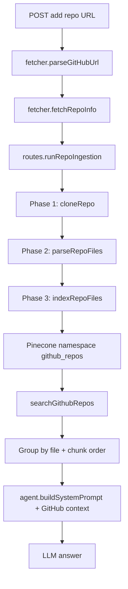

# GitHub Repos RAG — Deep Architecture

This document covers the architecture layer only, grounded in:

- server/githubRepos/config.js
- server/githubRepos/fetcher.js
- server/githubRepos/parser.js
- server/githubRepos/indexer.js
- server/githubRepos/search.js
- server/githubRepos/routes.js
- integration in server/agent.js and server/index.js

Note:

- The historical design mentions fetch-then-filter with topK \* 2.
- Current code in search.js uses similaritySearchWithScore(query, topK, filter).

---

## 1.1 Embedding Architecture

### Why llama-text-embed-v2 (1024 dims) fits this use case

The current system indexes mixed repository artifacts:

- code files (many languages)
- docs (README, markdown, rst, txt)
- config/build files (package.json, pom.xml, Dockerfile, etc.)

A general-purpose embedding model with stable multilingual/text semantics and medium dimensionality is a pragmatic fit because retrieval queries are usually natural-language questions about code behavior, architecture, and intent.

Operationally:

- same provider family already used in the project
- no extra model-serving complexity
- predictable Pinecone behavior with cosine similarity at 1024 dimensions

### Role of chunk header in embedding enrichment

Current indexer prepends a structured header before embedding:

```js
const header = `## ${repoFullName} — ${file.path} [${language}] (chunk ${idx + 1}/${totalChunks})\n\n`;
pageContent: header + chunkText;
```

This anchors vectors with source metadata:

- disambiguates repeated symbols across files/repos
- adds source identity (repo/file/language/chunk position)
- helps downstream LLM produce file-aware answers

### Would a code-specific model perform better?

Potentially yes for fine-grained function matching, with trade-offs:

- Pros: better code-semantic discrimination
- Cons: reindex cost, migration complexity, potential degradation on prose-heavy queries

Recommendation:

- keep current model as baseline
- run offline A/B with one code-specialized candidate
- compare by query class (function-level vs architecture-level)

---

## 1.2 Retrieval Architecture

### Dual-filter strategy (repo + userId)

Current filter in search.js:

```js
const filter = {
  repo: { $in: enabledRepos },
  userId: { $eq: userIdStr },
};
```

Why required:

- all GitHub vectors are in one namespace (github_repos)
- userId enforces tenant isolation
- repo list enforces user-selected retrieval scope

If either is removed:

- no userId => cross-tenant leakage risk
- no repo => same-user irrelevant repo leakage

### Fetch-then-filter pattern vs direct fetch

Target rationale for 20 -> threshold -> 10:

- broader candidate pool
- threshold applied after expansion
- better robustness under noisy score tails

Current implementation:

```js
const rawResults = await store.similaritySearchWithScore(query, topK, filter);
```

Recommended architecture alignment:

- make fetch multiplier configurable
- fetch topK \* multiplier, then threshold, then trim to topK

### Group-by-file and chunk ordering

Current grouping pattern:

```js
const key = `${m.repo}:${m.filePath}`;
group.sort(
  (a, b) => (a.doc.metadata.chunkIndex || 0) - (b.doc.metadata.chunkIndex || 0),
);
```

Why it helps:

- converts scattered chunk matches into coherent file-local context
- reduces hallucinated cross-file stitching
- improves downstream answer faithfulness

---

## 1.3 Splitting Architecture

### Why semantic separators instead of naive split

The system uses extension-aware separators from CODE_SEPARATORS and selects them in indexer.js.

Example:

```js
".py": ["\nclass ", "\ndef ", "\nasync def ", "\n\n", "\n", " "],
".go": ["\nfunc ", "\ntype ", "\npackage ", "\n\n", "\n", " "],
".rs": ["\nfn ", "\npub fn ", "\nimpl ", "\nstruct ", "\nenum ", "\nmod ", "\n\n", "\n", " "],
```

Why:

- preserves semantic units (functions/classes/modules)
- improves embedding fidelity over fixed-window chunking

### Why code=3000, docs=2000, config=1500

From config.js:

```js
CODE_CHUNK_SIZE = 3000;
DOCS_CHUNK_SIZE = 2000;
CONFIG_CHUNK_SIZE = 1500;
```

Rationale:

- code needs broader local context
- docs need paragraph continuity
- config benefits from compact high-signal chunks

### Why overlap 500/400/200

From config.js:

```js
CODE_CHUNK_OVERLAP = 500;
DOCS_CHUNK_OVERLAP = 400;
CONFIG_CHUNK_OVERLAP = 200;
```

Rationale:

- code has higher boundary fragility
- docs moderate continuity need
- config lower long-range dependence

### Supported language-aware coverage

Dedicated extension separators for:

- .py, .java, .go, .rs, .rb, .php, .cs, .cpp, .c, .swift, .dart, .kt, .scala, .vue, .svelte
- plus default fallback (used by JS/TS and unsupported code extensions)

---

## 1.4 Ingestion Architecture

### 3-phase pipeline isolation

In routes.js background worker:

- cloning -> parsing -> indexing -> ready/error

Benefits:

- stage-level observability
- easier fault localization and retries
- deterministic cleanup via cleanupClone in finally block

### File priority and 500-file limit

Parser sorting logic:

```js
if (bn.startsWith("readme")) return 0;
if (f.type === "docs") return 1;
if (IMPORTANT_FILES.has(path.basename(f.absolutePath))) return 2;
if (f.type === "config") return 3;
return 4;
```

Impact:

- README/docs/config retained first in large repos
- improves retrieval quality under MAX_FILES_PER_REPO cap

### Binary detection robustness

Current parser checks null bytes in first up-to-8KB:

```js
const checkLength = Math.min(buffer.length, 8192);
for (let i = 0; i < checkLength; i++) {
  if (buffer[i] === 0) return true;
}
```

Why better than extension-only filtering:

- catches misnamed binaries
- prevents garbage embeddings
- reduces retrieval pollution

---

## Architecture Diagram


