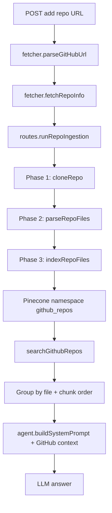

# GitHub Repos RAG System — Deep Architecture, Hyperparameter Tuning, Regularization, and Overfitting Analysis

This document is grounded in the current production implementation under:

- `server/githubRepos/config.js`
- `server/githubRepos/fetcher.js`
- `server/githubRepos/parser.js`
- `server/githubRepos/indexer.js`
- `server/githubRepos/search.js`
- `server/githubRepos/routes.js`
- integration in `server/agent.js` and route mount in `server/index.js`

Important implementation note:

- Documentation/history describes fetch-then-filter with `topK * 2` (20 fetch, 10 return), but current `search.js` executes `similaritySearchWithScore(query, topK, filter)` directly. This analysis calls out both: current behavior and recommended target behavior.

---

## 1. Deep Architecture

## 1.1 Embedding Architecture

### Why llama-text-embed-v2 (1024 dims) fits this use case

The current system indexes mixed repository artifacts:

- code files (many languages)
- docs (`README`, markdown, rst, txt)
- config/build files (`package.json`, `pom.xml`, `Dockerfile`, etc.)

A general-purpose embedding model with stable multilingual/text semantics and medium dimensionality is a pragmatic fit because retrieval queries are usually natural-language questions about code behavior, architecture, and intent. In this flow, semantic bridging between natural-language query and code/doc snippets matters more than pure token-level code matching.

Operationally it also aligns with current stack simplicity:

- same provider family already used in the project
- no extra model-serving complexity
- predictable Pinecone behavior with cosine similarity at 1024 dimensions

### Role of chunk header in embedding enrichment

Current indexer prepends a structured header before embedding:

```js
const header = `## ${repoFullName} — ${file.path} [${language}] (chunk ${idx + 1}/${totalChunks})\n\n`;
pageContent: header + chunkText;
```

This acts as retrieval-side context anchoring:

- disambiguates identical symbols across files/repos
- injects source identity (repo/file/language/chunk position)
- helps downstream LLM produce file-aware answers and citations

Without header, embeddings from repeated boilerplate patterns (imports/helpers) are less distinguishable.

### Would a code-specific model perform better?

Short answer: potentially yes for function-level code matching, but with trade-offs.

Potential gains from code-optimized embeddings:

- better semantic mapping for API usage, control flow patterns, and symbol relations
- improved recall for low-documentation repos

Trade-offs vs current choice:

- migration complexity (new model behavior + reindex)
- larger cost/latency footprint depending on provider
- may reduce performance on mixed prose-heavy queries (README/architecture questions)

Recommendation for this system:

- keep `llama-text-embed-v2` as baseline
- run an A/B offline benchmark against one code-specialized candidate
- decide using retrieval metrics by query class (function-level vs architecture-level)

---

## 1.2 Retrieval Architecture

### Dual-filter strategy (`repo` + `userId`)

Current search filter in `search.js`:

```js
const filter = {
  repo: { $in: enabledRepos },
  userId: { $eq: userIdStr },
};
```

Architectural necessity:

- all GitHub vectors share one namespace: `github_repos`
- `userId` enforces tenant isolation
- `repo` constrains retrieval to user-enabled repositories

If either filter is removed:

- no `userId`: risk cross-tenant leakage
- no `repo`: irrelevant hits from unrelated repos owned by the same user

### Fetch-then-filter pattern (`topK*2`) vs direct fetch

Target/documented rationale for 20 -> threshold -> 10:

- create broader candidate pool
- apply threshold after candidate expansion
- preserve result quality under noisy ranking tails

Current implementation difference:

```js
const rawResults = await store.similaritySearchWithScore(query, topK, filter);
```

Practical recommendation:

- move to `fetchMultiplier = 2` as configurable parameter
- keep return count at `topK`

### Group-by-file post-processing and chunk ordering

Current grouping in `search.js`:

```js
const key = `${m.repo}:${m.filePath}`;
...
group.sort((a, b) => (a.doc.metadata.chunkIndex || 0) - (b.doc.metadata.chunkIndex || 0));
```

Why this improves LLM grounding:

- avoids scattered isolated chunks from many files
- reconstructs contiguous local context inside a file
- reduces hallucinated linkages between unrelated snippets

Raw cosine-ranked chunks often optimize local similarity, not narrative coherence. Group-and-order restores coherence before prompt injection.

---

## 1.3 Splitting Architecture

### Why semantic separators instead of naive character split

The system uses extension-aware separators from `config.js` (`CODE_SEPARATORS`) and selects them in `indexer.js`.

Example (Python/Go/Rust):

```js
".py": ["\nclass ", "\ndef ", "\nasync def ", "\n\n", "\n", " "],
".go": ["\nfunc ", "\ntype ", "\npackage ", "\n\n", "\n", " "],
".rs": ["\nfn ", "\npub fn ", "\nimpl ", "\nstruct ", "\nenum ", "\nmod ", "\n\n", "\n", " "],
```

This design preserves semantic units (functions/classes/modules) better than fixed windows, improving both embedding quality and answer faithfulness.

### Why code=3000, docs=2000, config=1500

Current config:

```js
CODE_CHUNK_SIZE = 3000;
DOCS_CHUNK_SIZE = 2000;
CONFIG_CHUNK_SIZE = 1500;
```

Rationale by artifact type:

- Code: needs more span to hold function body + helpers + local context.
- Docs: paragraph-level coherence works at medium chunk size.
- Config: high-density structured entries; smaller windows are enough and reduce noise.

### Why overlap 500/400/200

Current config:

```js
CODE_CHUNK_OVERLAP = 500;
DOCS_CHUNK_OVERLAP = 400;
CONFIG_CHUNK_OVERLAP = 200;
```

Code needs highest overlap because boundary splits often cut across signature/body/call-site context. Docs still benefit from paragraph continuity. Config files usually have less long-range dependency, so lower overlap is sufficient.

### Supported language-aware splitting coverage

Implementation has dedicated extension separators for:

- `.py`, `.java`, `.go`, `.rs`, `.rb`, `.php`, `.cs`, `.cpp`, `.c`, `.swift`, `.dart`, `.kt`, `.scala`, `.vue`, `.svelte`
- plus `default` fallback used by JS/TS and unsupported code extensions

This effectively covers the 16-language architecture intent, with some languages relying on `default` rather than a dedicated list.

---

## 1.4 Ingestion Architecture

### 3-phase pipeline isolation

In `routes.js` background worker (`runRepoIngestion`):

- Phase 1: Clone (`cloning`)
- Phase 2: Parse (`parsing`)
- Phase 3: Index (`indexing`)
- Final: `ready` or `error`

Isolation benefits:

- clear observability/status per stage
- easier fault localization and retries
- bounded cleanup lifecycle via `finally { cleanupClone(cloneDir) }`

### File priority system and 500-file cap impact

Parser sorting logic:

```js
if (bn.startsWith("readme")) return 0;
if (f.type === "docs") return 1;
if (IMPORTANT_FILES.has(path.basename(f.absolutePath))) return 2;
if (f.type === "config") return 3;
return 4;
```

Impact under `MAX_FILES_PER_REPO = 500`:

- highest information-density files are kept first
- large repos still retain architecture docs and key configs even when truncated
- improves early retrieval quality for system-level questions

### Binary detection robustness

Current parser checks null bytes in first up-to-8KB of file buffer:

```js
const checkLength = Math.min(buffer.length, 8192);
for (let i = 0; i < checkLength; i++) {
  if (buffer[i] === 0) return true;
}
```

Why better than extension-only filtering:

- catches wrongly named binaries
- avoids embedding garbage bytes
- prevents retrieval pollution and token waste

Note:

- historical docs mention first 512 bytes; code currently uses 8192 bytes.

---

## Architecture Diagram



---

## 2. Hyperparameter Tuning

## 2.1 Chunking Parameters

| Parameter         | Current Value | Rationale                                                            | Tuning Experiment                                                                          |
| ----------------- | ------------: | -------------------------------------------------------------------- | ------------------------------------------------------------------------------------------ |
| Code chunk size   |          3000 | Preserve whole function/class regions and reduce over-fragmentation. | Sweep 1800, 2400, 3000, 3600; evaluate Recall@10 and MRR on function-level queries.        |
| Code overlap      |           500 | Maintains continuity across function boundaries and partial splits.  | Sweep 200, 350, 500, 700 while fixing chunk size; measure duplicate-hit rate vs Recall@10. |
| Docs chunk size   |          2000 | Keeps coherent paragraphs/sections without excessive chunk count.    | Sweep 1200, 1600, 2000, 2400 on architecture/documentation queries.                        |
| Docs overlap      |           400 | Prevents losing section transitions across splits.                   | Sweep 150, 250, 400, 600; track NDCG@10 for architecture-level questions.                  |
| Config chunk size |          1500 | Config files are compact, high-density, and less narrative.          | Sweep 700, 1000, 1500, 2000 and compare relevance on build/dependency queries.             |
| Config overlap    |           200 | Enough for boundary continuity with low redundancy.                  | Sweep 50, 100, 200, 300 and monitor retrieval precision for config-targeted prompts.       |

## 2.2 Search Parameters

| Parameter        |                               Current Value | Rationale                                                               | Tuning Experiment                                                                             |
| ---------------- | ------------------------------------------: | ----------------------------------------------------------------------- | --------------------------------------------------------------------------------------------- |
| Score threshold  |                                        0.25 | Filters weak matches while keeping enough candidates for broad queries. | Sweep 0.20, 0.25, 0.30, 0.35; report precision/recall trade-off and answer groundedness rate. |
| topK (returned)  |                                          10 | Balances context coverage and prompt budget.                            | Sweep 5, 8, 10, 15; evaluate answer quality and token overhead.                               |
| Fetch multiplier | 2x target (20 fetch) / currently 1x in code | Candidate expansion before threshold can improve final quality.         | Implement `rawK = topK * fetchMultiplier`; compare 1x, 2x, 3x under same threshold.           |
| Search timeout   |                                      8000ms | Protects chat latency budget with room for Pinecone + formatting.       | Test 5000, 8000, 12000; track timeout rate and p95 end-to-end chat latency.                   |

## 2.3 Ingestion Parameters

| Parameter      | Current Value | Rationale                                                            | Tuning Experiment                                                                  |
| -------------- | ------------: | -------------------------------------------------------------------- | ---------------------------------------------------------------------------------- |
| Batch size     |            96 | Stable upsert payload size with predictable memory/network behavior. | Test 64, 96, 128; compare indexing throughput, failures, and retry rate.           |
| Max files/repo |           500 | Prevents huge repos from dominating indexing time/cost.              | Test 300, 500, 800 with priority sorting; measure Recall@10 and ingestion latency. |
| Max file size  |         100KB | Excludes minified/generated blobs and oversized noise.               | Test 64KB, 100KB, 160KB; inspect retrieval gain vs index pollution.                |
| Clone timeout  |          120s | Avoids hung ingestion workers on network/repo issues.                | Test adaptive timeout by repo size percentiles from GitHub API metadata.           |
| Max repos/user |            20 | Tenant quota control and capacity protection.                        | Test 20 vs 30 for power users; monitor index growth and cross-user latency impact. |

## 2.4 Recommended Tuning Priority (by retrieval quality impact)

1. Score threshold

- Directly controls noise entering LLM context; biggest quality lever.

2. Code chunk size and code overlap

- Most queries target code behavior; chunk geometry strongly affects semantic fidelity.

3. Fetch multiplier (implement 2x candidate expansion)

- Improves robustness when score distribution is noisy.

4. topK returned

- Controls context breadth; too low misses dependencies, too high dilutes relevance.

5. Max files/repo + priority strategy

- Impacts whether critical files are even indexed in large repos.

6. Docs/config chunk parameters

- Secondary to code-heavy use cases but important for architecture/build questions.

7. Batch size, clone timeout, max repos/user

- Mostly infra/operational; low direct retrieval-quality effect.

---

## 3. Regularization (Retrieval-Focused)

In this RAG context, regularization means constraining retrieval to semantically meaningful, low-noise context.

## 3.1 Existing Regularization Mechanisms

### Score threshold (0.25)

- Mechanism: removes low-score matches before prompt construction.
- Regularization effect: suppresses accidental semantic neighbors.

### Fetch-then-filter (20 -> 10)

- Intended mechanism in docs/system design: widen candidate pool then prune.
- Regularization effect: avoids over-committing to a narrow initial ranking.
- Current status: not fully implemented in `search.js` yet.

### Language-aware splitting

- Mechanism: split on semantic boundaries (`def`, `class`, `func`, etc.).
- Regularization effect: reduces broken-context embeddings that attract false positives.

### Chunk header prepending

- Mechanism: include repo/file/language/chunk ordinal in each embedded text.
- Regularization effect: anchors vectors in source context; reduces ambiguous matches.

### File-type segregation (code/docs/config)

- Mechanism: differentiated chunking profiles by artifact type.
- Regularization effect: prevents config/doc noise from dominating code retrieval.

### Binary detection

- Mechanism: null-byte scanning before indexing.
- Regularization effect: blocks non-semantic binary payloads from index.

### Ignored directories list

- Mechanism: skip dependency/build/cache/editor artifact folders.
- Regularization effect: keeps index focused on source-of-truth files.

## 3.2 Proposed Additional Regularization

### 1) Near-duplicate chunk suppression

Description:

- Remove highly similar chunks within same repo before upsert.

How it reduces noise:

- prevents repetitive templates/generated blocks from flooding nearest neighbors.

Implementation sketch:

```js
import crypto from "node:crypto";

function normalizeForDedup(text) {
  return text.replace(/\s+/g, " ").trim().toLowerCase();
}

function hashChunk(text) {
  return crypto
    .createHash("sha1")
    .update(normalizeForDedup(text))
    .digest("hex");
}

function dedupDocuments(docs) {
  const seen = new Set();
  return docs.filter((d) => {
    const h = hashChunk(d.pageContent.slice(0, 5000));
    if (seen.has(h)) return false;
    seen.add(h);
    return true;
  });
}
```

Trade-off:

- may remove intentionally repeated boilerplate that is occasionally useful.

### 2) Minimum semantic chunk length gate

Description:

- Drop tiny code chunks unless they contain strong symbols/imports.

How it reduces noise:

- short fragments are often structurally weak and overfit lexical tokens.

Implementation sketch:

```js
function keepChunk(chunk, fileType) {
  const minLen = fileType === "code" ? 120 : 80;
  if (chunk.length >= minLen) return true;
  return /(class|function|def|interface|SELECT|CREATE|import)/i.test(chunk);
}
```

Trade-off:

- may drop concise but important constants/config snippets.

### 3) Lightweight reranking layer

Description:

- After Pinecone retrieval, rerank top candidates using a stronger lexical+semantic scoring pass.

How it reduces noise:

- second-stage scoring corrects cosine-only ranking errors.

Implementation sketch:

```js
function rerank(query, items) {
  const q = query.toLowerCase();
  return items
    .map((it) => {
      const txt = it.doc.pageContent.toLowerCase();
      const lexicalBoost = ["function", "class", "def", "import"].some(
        (k) => q.includes(k) && txt.includes(k),
      )
        ? 0.05
        : 0;
      return { ...it, finalScore: it.score + lexicalBoost };
    })
    .sort((a, b) => b.finalScore - a.finalScore);
}
```

Trade-off:

- additional latency and tuning complexity.

### 4) Query-intent adaptive threshold

Description:

- Use dynamic threshold by query type (function-level vs architecture-level).

How it reduces noise:

- strict threshold for precise code lookup, looser threshold for broad architectural questions.

Implementation sketch:

```js
function inferQueryType(query) {
  const q = query.toLowerCase();
  if (
    /(how does .* work|where is .* implemented|function|method|class)/.test(q)
  )
    return "function";
  if (/(architecture|structure|flow|module|dependency)/.test(q))
    return "architecture";
  return "general";
}

function thresholdFor(type) {
  if (type === "function") return 0.3;
  if (type === "architecture") return 0.22;
  return 0.25;
}
```

Trade-off:

- intent classification mistakes can over-prune relevant results.

### 5) Path-aware negative filter rules

Description:

- Exclude low-value path patterns at retrieval-time (`*.min.js`, lockfiles, snapshots) even if indexed.

How it reduces noise:

- prevents known noisy artifacts from resurfacing.

Implementation sketch:

```js
function isLowValuePath(filePath = "") {
  return /\.min\.js$|package-lock\.json$|yarn\.lock$|\.snap$/.test(filePath);
}

const filtered = scored.filter((r) => !isLowValuePath(r.doc.metadata.filePath));
```

Trade-off:

- edge case where minified file is actually needed for debugging.

---

## 4. Overfitting Analysis

In this RAG setting, overfitting means retrieval favoring surface-form overlap over true semantic intent.

## 4.1 Overfitting Risk Factors

### Shared embedding model (not code-specific)

Risk:

- natural-language-biased semantic space may miss subtle code semantics (API contracts, type-level meaning).

Current mitigation:

- language-aware splitting + source header + grouping by file.

Residual risk level: Medium.

### Large code chunks (3000)

Risk:

- embeddings may average multiple concerns, diluting intent signal.

Current mitigation:

- separators and overlap preserve boundaries.

Residual risk level: Medium.

### Low threshold (0.25)

Risk:

- permissive inclusion can admit accidental semantic neighbors.

Current mitigation:

- thresholding itself still removes very weak matches.

Residual risk level: Medium-High for broad queries.

### No dedicated reranker

Risk:

- cosine-only ordering may overvalue lexical coincidence.

Current mitigation:

- file grouping and chunk ordering improve coherence, not ranking accuracy.

Residual risk level: High.

### Header repetition in every chunk

Risk:

- repeated metadata tokens could bias similarity toward repository/path markers.

Current mitigation:

- header content is informative and generally aligned with desired retrieval constraints.

Residual risk level: Low-Medium; monitor with ablation test (with/without header).

## 4.2 Evaluation Protocol

### What is a good retrieval?

A retrieval result is good if:

- at least one top result directly answers the query intent,
- supporting neighboring chunks from same file are present when needed,
- retrieved context enables a grounded answer with correct file references.

### Query set design (3 categories)

1. Function-level

- "Where is token verification implemented?"
- "How does retry logic in API client work?"
- "Show me where repository cloning timeout is defined."

2. Architecture-level

- "How does GitHub ingestion flow from add endpoint to Pinecone?"
- "What are the phases and status transitions in repo indexing?"
- "How are user preferences applied during retrieval?"

3. Cross-file dependency

- "How does search context move from search.js into agent prompt construction?"
- "Which module controls max repo limits and where is it enforced in routes?"
- "How does parser output shape indexer metadata fields?"

### Metrics

- MRR: good for first-relevant-hit quality (critical for chat latency and top context).
- Recall@K: good for coverage (especially cross-file queries).
- NDCG@K: good for graded relevance ordering.

Most appropriate primary metric for this system:

- MRR@10 as primary (because top context quality most affects generated answer),
- with Recall@10 as secondary guardrail for multi-file questions.

### Labeling strategy (ground truth)

1. Build gold query set (50-100 queries) from actual product scenarios.
2. For each query, annotate relevant chunks/files with 3 grades:

- 2 = directly answers
- 1 = useful supporting context
- 0 = irrelevant

3. Use dual annotators (engineer + reviewer), resolve disagreements.
4. Store labels in JSON and run offline benchmark script per parameter set.

Example label schema:

```js
{
  queryId: "Q12",
  query: "How is clone timeout configured?",
  relevant: [
    { repo: "owner/repo", filePath: "server/githubRepos/fetcher.js", chunkIndex: 0, grade: 2 },
    { repo: "owner/repo", filePath: "server/githubRepos/config.js", chunkIndex: 0, grade: 1 }
  ]
}
```

## 4.3 Overfitting Mitigations Already in Place

- Score threshold -> suppresses accidental low-signal matches.
- Group-by-file + chunkIndex order -> reduces chunk-level overfitting and restores local continuity.
- Language-aware splitting -> avoids semantic boundary violations that produce noisy vectors.
- Project tree context -> adds structural prior for architecture questions.
- Dual filter (`repo`, `userId`) -> removes tenant/corpus contamination.

## 4.4 Proposed Mitigations (Prioritized)

| Mitigation                                         | Expected Retrieval Improvement | Implementation Cost | Recommendation                                               |
| -------------------------------------------------- | ------------------------------ | ------------------- | ------------------------------------------------------------ |
| Implement fetch multiplier (2x) + threshold + trim | Medium-High                    | Low                 | Do first; easy code change with strong upside.               |
| Add near-duplicate suppression before upsert       | Medium                         | Medium              | Do second for large repos with template repetition.          |
| Add adaptive threshold by query intent             | Medium                         | Medium              | Pilot with logs and fallback to static 0.25.                 |
| Add reranking stage for top candidates             | High                           | High                | Implement after baseline benchmark harness exists.           |
| Add min chunk length gate                          | Low-Medium                     | Low                 | Enable with conservative thresholds and monitor false drops. |
| Header ablation and weighted header design         | Medium                         | Medium              | Test if header is helping or causing source-token bias.      |

---

## Implementation Sketches for Immediate Improvements

### A) Fetch-then-filter (2x) in search.js

```js
const fetchMultiplier = 2;
const rawK = Math.max(topK, topK * fetchMultiplier);
const rawResults = await store.similaritySearchWithScore(query, rawK, filter);

const scored = rawResults
  .map(([doc, score]) => ({ doc, score }))
  .filter((r) => r.score >= SEARCH_SCORE_THRESHOLD)
  .slice(0, topK);
```

### B) Config-driven search parameters

```js
// config.js
export const SEARCH_FETCH_MULTIPLIER = 2;
export const SEARCH_TIMEOUT_MS = 8000;

// search.js
import { SEARCH_FETCH_MULTIPLIER, SEARCH_TIMEOUT_MS } from "./config.js";
```

### C) Optional reranking hook

```js
function maybeRerank(query, scored, enabled = false) {
  if (!enabled) return scored;
  return rerank(query, scored);
}
```

---

## Final Recommendations for This System

1. Close the code-vs-doc gap first:

- implement explicit fetch multiplier (2x) and make it config-driven.

2. Build offline evaluation harness before major model changes:

- query set + labeled ground truth + MRR/Recall/NDCG reporting.

3. Tune threshold and code chunk geometry first:

- these are highest-impact quality levers in current architecture.

4. Add regularization progressively:

- dedup + min chunk gate first, then adaptive threshold, then reranking.

5. Keep tenant isolation guarantees unchanged:

- retain shared namespace with strict `repo + userId` filter discipline.
