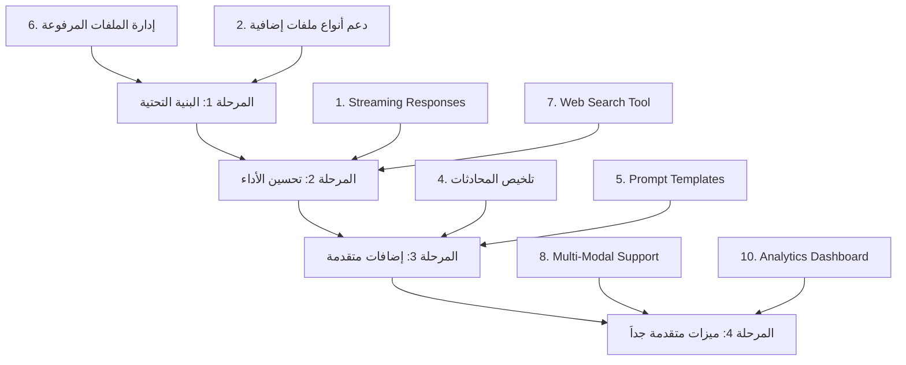

# 📋 خطة تنفيذ الإضافات — Agentic Personal Assistant

> [!NOTE]
> هذه الخطة تغطي الإضافات المطلوبة: **1, 2, 4, 5, 6, 7, 8, 10** من ملف DOCS.md

---

## 📊 ملخص الإضافات المطلوبة

| # | الإضافة | الأولوية | التعقيد | الملفات المتأثرة |
|---|---------|----------|---------|-----------------|
| 1 | Streaming Responses (بث الردود) | 🔴 عالية | متوسط | [server/index.js](file:///c:/Users/world/Desktop/agentic-personal-assistant/server/index.js), [server/agent.js](file:///c:/Users/world/Desktop/agentic-personal-assistant/server/agent.js), [client/src/pages/Chat.jsx](file:///c:/Users/world/Desktop/agentic-personal-assistant/client/src/pages/Chat.jsx) |
| 2 | دعم أنواع ملفات إضافية | 🔴 عالية | سهل | [server/index.js](file:///c:/Users/world/Desktop/agentic-personal-assistant/server/index.js), [server/ingest.js](file:///c:/Users/world/Desktop/agentic-personal-assistant/server/ingest.js), [client/src/pages/Upload.jsx](file:///c:/Users/world/Desktop/agentic-personal-assistant/client/src/pages/Upload.jsx) |
| 4 | تلخيص المحادثات الطويلة | 🟡 متوسطة | متوسط | [server/agent.js](file:///c:/Users/world/Desktop/agentic-personal-assistant/server/agent.js), [server/db.js](file:///c:/Users/world/Desktop/agentic-personal-assistant/server/db.js) |
| 5 | نظام Prompt Templates | 🟡 متوسطة | متوسط | [server/db.js](file:///c:/Users/world/Desktop/agentic-personal-assistant/server/db.js), [server/index.js](file:///c:/Users/world/Desktop/agentic-personal-assistant/server/index.js), [server/agent.js](file:///c:/Users/world/Desktop/agentic-personal-assistant/server/agent.js), [client/src/pages/Chat.jsx](file:///c:/Users/world/Desktop/agentic-personal-assistant/client/src/pages/Chat.jsx) |
| 6 | إدارة الملفات المرفوعة | 🟡 متوسطة | متوسط | [server/db.js](file:///c:/Users/world/Desktop/agentic-personal-assistant/server/db.js), [server/index.js](file:///c:/Users/world/Desktop/agentic-personal-assistant/server/index.js), [server/ingest.js](file:///c:/Users/world/Desktop/agentic-personal-assistant/server/ingest.js), صفحة جديدة `Documents.jsx` |
| 7 | Web Search Tool | 🟡 متوسطة | سهل | [server/tools.js](file:///c:/Users/world/Desktop/agentic-personal-assistant/server/tools.js), [server/agent.js](file:///c:/Users/world/Desktop/agentic-personal-assistant/server/agent.js), [server/package.json](file:///c:/Users/world/Desktop/agentic-personal-assistant/server/package.json) |
| 8 | Multi-Modal Support (صور + صوت) | 🟢 متقدمة | عالي | [server/index.js](file:///c:/Users/world/Desktop/agentic-personal-assistant/server/index.js), [server/agent.js](file:///c:/Users/world/Desktop/agentic-personal-assistant/server/agent.js), [client/src/pages/Chat.jsx](file:///c:/Users/world/Desktop/agentic-personal-assistant/client/src/pages/Chat.jsx) |
| 10 | Analytics Dashboard | 🟢 متقدمة | متوسط | [server/db.js](file:///c:/Users/world/Desktop/agentic-personal-assistant/server/db.js), [server/index.js](file:///c:/Users/world/Desktop/agentic-personal-assistant/server/index.js), صفحة جديدة `Analytics.jsx` |

---

## 🔵 ترتيب التنفيذ المقترح



---

## 🟢 المرحلة 1: البنية التحتية (الإضافات 6 و 2)

### ✅ الإضافة 6: إدارة الملفات المرفوعة

> **الهدف:** صفحة تعرض جميع الملفات التي رفعها المستخدم مع إمكانية الحذف

#### الخطوات:

**1. إضافة جدول `documents` في قاعدة البيانات — [server/db.js](file:///c:/Users/world/Desktop/agentic-personal-assistant/server/db.js)**

```sql
CREATE TABLE IF NOT EXISTS documents (
  id          INTEGER PRIMARY KEY AUTOINCREMENT,
  user_id     INTEGER NOT NULL REFERENCES users(id) ON DELETE CASCADE,
  filename    TEXT    NOT NULL,
  original_name TEXT  NOT NULL,
  file_size   INTEGER NOT NULL DEFAULT 0,
  file_type   TEXT    NOT NULL DEFAULT 'pdf',
  chunk_count INTEGER NOT NULL DEFAULT 0,
  status      TEXT    NOT NULL DEFAULT 'processing' CHECK(status IN ('processing','ready','error')),
  created_at  TEXT    DEFAULT (datetime('now'))
);
```

**2. تعديل عملية الـ Ingest لحفظ معلومات الملف — [server/ingest.js](file:///c:/Users/world/Desktop/agentic-personal-assistant/server/ingest.js)**

```diff
-export const ingestData = async (filePath, userId) => {
+export const ingestData = async (filePath, userId, originalName, fileSize) => {
+  // حفظ سجل الملف في SQLite
+  const docResult = db.prepare(
+    `INSERT INTO documents (user_id, filename, original_name, file_size, file_type, status) VALUES (?, ?, ?, ?, ?, 'processing')`
+  ).run(userId, path.basename(filePath), originalName, fileSize, path.extname(originalName).slice(1));
+  const docId = docResult.lastInsertRowid;
+
   // ... existing ingestion logic ...
+
+  // تحديث حالة الملف وعدد الأجزاء
+  db.prepare(`UPDATE documents SET status = 'ready', chunk_count = ? WHERE id = ?`)
+    .run(chunks.length, docId);
+
+  return docId;
```

**3. إضافة API endpoints لإدارة الملفات — [server/index.js](file:///c:/Users/world/Desktop/agentic-personal-assistant/server/index.js)**

```javascript
// قائمة ملفات المستخدم
app.get("/api/documents", requireAuth, (req, res) => {
  const docs = db.prepare(
    `SELECT id, original_name, file_size, file_type, chunk_count, status, created_at 
     FROM documents WHERE user_id = ? ORDER BY created_at DESC`
  ).all(req.user.userId);
  res.json(docs);
});

// حذف ملف
app.delete("/api/documents/:id", requireAuth, async (req, res) => {
  const doc = db.prepare(
    `SELECT id FROM documents WHERE id = ? AND user_id = ?`
  ).get(req.params.id, req.user.userId);
  if (!doc) return res.status(404).json({ error: "الملف غير موجود" });
  
  // حذف vectors من Pinecone (بحسب metadata.docId)
  // حذف السجل من SQLite
  db.prepare(`DELETE FROM documents WHERE id = ?`).run(req.params.id);
  res.json({ ok: true });
});
```

**4. إنشاء صفحة إدارة الملفات — `client/src/pages/Documents.jsx`**

- عرض قائمة الملفات (اسم، حجم، نوع، تاريخ الرفع، حالة)
- زر حذف لكل ملف مع تأكيد
- مؤشرات حالة (جاري المعالجة / جاهز / خطأ)
- تصميم متوافق مع التصميم الحالي (Dark mode + Tailwind)

**5. تحديث التنقل — [client/src/components/Sidebar.jsx](file:///c:/Users/world/Desktop/agentic-personal-assistant/client/src/components/Sidebar.jsx) + [client/src/App.jsx](file:///c:/Users/world/Desktop/agentic-personal-assistant/client/src/App.jsx)**

- إضافة عنصر "مستنداتي" في القائمة الجانبية
- إضافة Route `/documents`

---

### ✅ الإضافة 2: دعم أنواع ملفات إضافية

> **الهدف:** دعم Word (.docx), PowerPoint (.pptx), TXT, CSV بجانب PDF

#### الخطوات:

**1. تثبيت المكتبات المطلوبة**

```bash
cd server && npm install mammoth csv-parse officeparser
```

| المكتبة | الاستخدام |
|---------|-----------|
| `mammoth` | قراءة ملفات Word (.docx) |
| `csv-parse` | قراءة ملفات CSV |
| `officeparser` | قراءة PowerPoint (.pptx) |

**2. تعديل Multer filter — [server/index.js](file:///c:/Users/world/Desktop/agentic-personal-assistant/server/index.js)**

```diff
 fileFilter: (_req, file, cb) => {
-  const isPdf = file.mimetype === "application/pdf" || 
-    (file.originalname || "").toLowerCase().endsWith(".pdf");
-  cb(isPdf ? null : new Error("Only PDF files are allowed"), isPdf);
+  const allowedExtensions = ['.pdf', '.docx', '.pptx', '.txt', '.csv'];
+  const allowedMimes = [
+    'application/pdf',
+    'application/vnd.openxmlformats-officedocument.wordprocessingml.document',
+    'application/vnd.openxmlformats-officedocument.presentationml.presentation',
+    'text/plain', 'text/csv'
+  ];
+  const ext = path.extname(file.originalname || "").toLowerCase();
+  const allowed = allowedMimes.includes(file.mimetype) || allowedExtensions.includes(ext);
+  cb(allowed ? null : new Error("Unsupported file type"), allowed);
 },
```

**3. إنشاء ملف Document Loader موحّد — `server/documentLoader.js` (ملف جديد)**

```javascript
// يحدد نوع الملف ويستخدم الـ loader المناسب
export async function loadDocument(filePath) {
  const ext = path.extname(filePath).toLowerCase();
  switch (ext) {
    case '.pdf':   return loadPDF(filePath);
    case '.docx':  return loadDocx(filePath);
    case '.pptx':  return loadPptx(filePath);
    case '.txt':   return loadTxt(filePath);
    case '.csv':   return loadCsv(filePath);
    default:       throw new Error(`Unsupported file type: ${ext}`);
  }
}
```

**4. تعديل [ingest.js](file:///c:/Users/world/Desktop/agentic-personal-assistant/server/ingest.js) لاستخدام الـ loader الجديد**

**5. تحديث واجهة الرفع — [client/src/pages/Upload.jsx](file:///c:/Users/world/Desktop/agentic-personal-assistant/client/src/pages/Upload.jsx)**

```diff
-accept="application/pdf,.pdf"
+accept=".pdf,.docx,.pptx,.txt,.csv"
```

- تحديث النص التوضيحي ليعكس الأنواع المدعومة
- تحديث أيقونات الملفات بحسب النوع

---

## 🟡 المرحلة 2: تحسين الأداء (الإضافات 1 و 7)

### ✅ الإضافة 1: Streaming Responses (بث الردود كلمة بكلمة)

> **الهدف:** عرض الرد تدريجياً مثل ChatGPT باستخدام SSE

#### الخطوات:

**1. إنشاء endpoint SSE جديد — [server/index.js](file:///c:/Users/world/Desktop/agentic-personal-assistant/server/index.js)**

```javascript
app.post("/api/chat/stream", requireAuth, async (req, res) => {
  // إعداد SSE headers
  res.setHeader("Content-Type", "text/event-stream");
  res.setHeader("Cache-Control", "no-cache");
  res.setHeader("Connection", "keep-alive");
  res.flushHeaders();
  
  // ... conversation logic (same as /api/chat) ...
  
  // استخدام streamAgent بدلاً من runAgent
  const stream = await streamAgent({ userId, conversationId, message });
  
  for await (const chunk of stream) {
    res.write(`data: ${JSON.stringify({ type: "token", content: chunk })}\n\n`);
  }
  
  res.write(`data: ${JSON.stringify({ type: "done" })}\n\n`);
  res.end();
});
```

**2. إضافة دالة `streamAgent` — [server/agent.js](file:///c:/Users/world/Desktop/agentic-personal-assistant/server/agent.js)**

```javascript
export async function* streamAgent({ userId, conversationId, message }) {
  // نفس إعداد الـ Agent الحالي
  // لكن مع استخدام streamEvents() بدلاً من invoke()
  
  const stream = await agent.streamEvents(
    { messages: [...history, { role: "human", content: message }] },
    { configurable: { thread_id: `conv_${conversationId}` }, version: "v2" }
  );
  
  let fullResponse = "";
  for await (const event of stream) {
    if (event.event === "on_chat_model_stream") {
      const token = event.data?.chunk?.content || "";
      if (token) {
        fullResponse += token;
        yield token;
      }
    }
  }
  
  // حفظ الرسائل بعد انتهاء الـ stream
  saveMessage(userId, conversationId, "user", message);
  saveMessage(userId, conversationId, "ai", fullResponse);
}
```

**3. تعديل صفحة Chat للدعم SSE — [client/src/pages/Chat.jsx](file:///c:/Users/world/Desktop/agentic-personal-assistant/client/src/pages/Chat.jsx)**

```javascript
// استخدام fetch مع ReadableStream
const response = await fetch("/api/chat/stream", { method: "POST", ... });
const reader = response.body.getReader();
const decoder = new TextDecoder();

// إضافة رسالة AI فارغة ثم تحديثها تدريجياً
setMessages(prev => [...prev, { role: "ai", text: "" }]);

while (true) {
  const { done, value } = await reader.read();
  if (done) break;
  
  const chunk = decoder.decode(value);
  // parse SSE data and update last message
  setMessages(prev => {
    const updated = [...prev];
    updated[updated.length - 1].text += parsedToken;
    return updated;
  });
}
```

**4. الاحتفاظ بالـ endpoint القديم `/api/chat` كـ fallback**

---

### ✅ الإضافة 7: Web Search Tool (بحث في الإنترنت)

> **الهدف:** إضافة أداة بحث في الإنترنت للـ Agent عندما لا يجد المعلومات في الملفات

#### الخطوات:

**1. تثبيت مكتبة Tavily**

```bash
cd server && npm install @langchain/community
```

> [!TIP]
> مكتبة `@langchain/community` موجودة فعلاً في المشروع — نحتاج فقط إلى إضافة `TAVILY_API_KEY` في [.env](file:///c:/Users/world/Desktop/agentic-personal-assistant/server/.env)

**2. إضافة أداة البحث — [server/tools.js](file:///c:/Users/world/Desktop/agentic-personal-assistant/server/tools.js)**

```javascript
import { TavilySearch } from "@langchain/tavily";

export function createWebSearchTool() {
  return new TavilySearch({
    maxResults: 5,
    apiKey: process.env.TAVILY_API_KEY,
  });
}
```

**3. تعديل الـ Agent لإضافة الأداة — [server/agent.js](file:///c:/Users/world/Desktop/agentic-personal-assistant/server/agent.js)**

```diff
-const agent = createAgent({
-  model,
-  tools: [searchTool],
+const webSearchTool = createWebSearchTool();
+const agent = createAgent({
+  model,
+  tools: [searchTool, webSearchTool],
```

**4. تحديث System Prompt ليوجّه الـ Agent**

```diff
 systemPrompt: `You are a helpful AI assistant with access to a knowledge base and web search.
-  When users ask questions, search the knowledge base using the available tools.
+  Strategy:
+  1. First, search the knowledge base for relevant information from uploaded documents.
+  2. If the knowledge base doesn't have enough information, use web search to find answers.
+  3. Always cite your sources (document or web).
   Be concise and accurate.`,
```

**5. إضافة `TAVILY_API_KEY` في [.env.example](file:///c:/Users/world/Desktop/agentic-personal-assistant/server/.env.example)**

---

## 🟠 المرحلة 3: إضافات متقدمة (الإضافات 4 و 5)

### ✅ الإضافة 4: تلخيص تلقائي للمحادثات الطويلة

> **الهدف:** عندما تتجاوز المحادثة 30 رسالة، يُلخّص الجزء القديم تلقائياً

#### الخطوات:

**1. إضافة عمود `summary` في جدول المحادثات — [server/db.js](file:///c:/Users/world/Desktop/agentic-personal-assistant/server/db.js)**

```sql
-- Migration
ALTER TABLE conversations ADD COLUMN summary TEXT DEFAULT NULL;
```

**2. إنشاء دالة التلخيص — [server/agent.js](file:///c:/Users/world/Desktop/agentic-personal-assistant/server/agent.js)**

```javascript
const SUMMARIZE_THRESHOLD = 30;

async function summarizeOldMessages(conversationId) {
  const count = db.prepare(
    `SELECT COUNT(*) as cnt FROM messages WHERE conversation_id = ?`
  ).get(conversationId).cnt;
  
  if (count < SUMMARIZE_THRESHOLD) return null;
  
  // جلب أقدم 20 رسالة
  const oldMessages = db.prepare(
    `SELECT role, content FROM messages WHERE conversation_id = ?
     ORDER BY created_at ASC LIMIT 20`
  ).all(conversationId);
  
  // تلخيصها باستخدام Gemini
  const model = new ChatGoogleGenerativeAI({ model: "gemini-2.0-flash" });
  const summary = await model.invoke([
    { role: "system", content: "لخّص هذه المحادثة في فقرة واحدة مختصرة:" },
    ...oldMessages.map(m => ({ role: m.role === "user" ? "human" : "assistant", content: m.content }))
  ]);
  
  // حفظ الملخص وحذف الرسائل القديمة
  db.prepare(`UPDATE conversations SET summary = ? WHERE id = ?`)
    .run(summary.content, conversationId);
  
  // حذف أقدم 20 رسالة (تم تلخيصها)
  db.prepare(
    `DELETE FROM messages WHERE id IN (
      SELECT id FROM messages WHERE conversation_id = ?
      ORDER BY created_at ASC LIMIT 20
    )`
  ).run(conversationId);
  
  return summary.content;
}
```

**3. تعديل [loadHistory](file:///c:/Users/world/Desktop/agentic-personal-assistant/server/agent.js#12-28) لتضمين الملخص**

```diff
 function loadHistory(conversationId) {
+  // تحميل الملخص إن وُجد
+  const conv = db.prepare(
+    `SELECT summary FROM conversations WHERE id = ?`
+  ).get(conversationId);
+  
   const rows = db.prepare(/* ... */).all(conversationId);
   const history = rows.map(r => ({ /* ... */ }));
   
+  // إضافة الملخص كرسالة نظام في بداية التاريخ
+  if (conv?.summary) {
+    history.unshift({
+      role: "system",
+      content: `Previous conversation summary:\n${conv.summary}`
+    });
+  }
+  
   return history;
 }
```

**4. استدعاء التلخيص بعد كل رد — في [runAgent](file:///c:/Users/world/Desktop/agentic-personal-assistant/server/agent.js#40-89)**

```diff
   saveMessage(userId, conversationId, "ai", output);
+  
+  // تلخيص تلقائي إذا تجاوز العدد
+  await summarizeOldMessages(conversationId);
```

---

### ✅ الإضافة 5: نظام Prompt Templates قابل للتخصيص

> **الهدف:** يسمح للمستخدم باختيار "شخصية" الـ Agent

#### الخطوات:

**1. إضافة جدول `prompts` — [server/db.js](file:///c:/Users/world/Desktop/agentic-personal-assistant/server/db.js)**

```sql
CREATE TABLE IF NOT EXISTS prompts (
  id          INTEGER PRIMARY KEY AUTOINCREMENT,
  user_id     INTEGER REFERENCES users(id) ON DELETE CASCADE,
  name        TEXT    NOT NULL,
  description TEXT,
  system_prompt TEXT  NOT NULL,
  icon        TEXT    DEFAULT '🤖',
  is_default  INTEGER DEFAULT 0,
  created_at  TEXT    DEFAULT (datetime('now'))
);
```

```javascript
// إدراج prompts افتراضية
const defaultPrompts = [
  { name: "مساعد عام", description: "مساعد ذكي شامل", icon: "🤖", prompt: "You are a helpful AI assistant..." },
  { name: "مطور برمجيات", description: "خبير برمجة ومراجعة كود", icon: "💻", prompt: "You are a senior software developer..." },
  { name: "كاتب محتوى", description: "كاتب إبداعي محترف", icon: "✍️", prompt: "You are a professional content writer..." },
  { name: "مترجم", description: "مترجم محترف متعدد اللغات", icon: "🌐", prompt: "You are a professional translator..." },
  { name: "محلل بيانات", description: "خبير تحليل بيانات", icon: "📊", prompt: "You are a data analyst expert..." },
];
```

**2. إضافة عمود `prompt_id` في المحادثات — [server/db.js](file:///c:/Users/world/Desktop/agentic-personal-assistant/server/db.js)**

```sql
ALTER TABLE conversations ADD COLUMN prompt_id INTEGER REFERENCES prompts(id);
```

**3. إضافة API endpoints — [server/index.js](file:///c:/Users/world/Desktop/agentic-personal-assistant/server/index.js)**

```javascript
// قائمة الـ Prompts (الافتراضية + الخاصة بالمستخدم)
app.get("/api/prompts", requireAuth, (req, res) => { ... });

// إنشاء prompt خاص
app.post("/api/prompts", requireAuth, (req, res) => { ... });

// حذف prompt خاص
app.delete("/api/prompts/:id", requireAuth, (req, res) => { ... });
```

**4. تعديل الـ Agent لاستخدام الـ prompt المختار — [server/agent.js](file:///c:/Users/world/Desktop/agentic-personal-assistant/server/agent.js)**

```diff
-export async function runAgent({ userId, conversationId, message }) {
+export async function runAgent({ userId, conversationId, message, promptId }) {
+  // تحميل الـ prompt المخصص
+  const promptTemplate = promptId 
+    ? db.prepare(`SELECT system_prompt FROM prompts WHERE id = ?`).get(promptId)
+    : null;
+  
   const agent = createAgent({
     model,
     tools: [searchTool, webSearchTool],
-    systemPrompt: `You are a helpful AI assistant...`,
+    systemPrompt: promptTemplate?.system_prompt || `You are a helpful AI assistant...`,
   });
```

**5. تعديل واجهة Chat — [client/src/pages/Chat.jsx](file:///c:/Users/world/Desktop/agentic-personal-assistant/client/src/pages/Chat.jsx)**

- إضافة dropdown لاختيار الشخصية عند بدء محادثة جديدة
- عرض أيقونة الشخصية المختارة في عنوان المحادثة
- إمكانية إنشاء شخصية مخصصة من خلال modal

---

## 🔴 المرحلة 4: ميزات متقدمة جداً (الإضافات 8 و 10)

### ✅ الإضافة 8: Multi-Modal Support (صور + صوت)

> **الهدف:** قبول صور ومقاطع صوتية مع الرسائل النصية

#### الخطوات:

**1. تعديل Multer للشات لقبول ملفات وسائط — [server/index.js](file:///c:/Users/world/Desktop/agentic-personal-assistant/server/index.js)**

```javascript
const chatUpload = multer({
  storage: multer.diskStorage({ destination: os.tmpdir(), ... }),
  fileFilter: (_req, file, cb) => {
    const allowed = ['image/jpeg', 'image/png', 'image/gif', 'image/webp', 'audio/mpeg', 'audio/wav', 'audio/webm'];
    cb(allowed.includes(file.mimetype) ? null : new Error("Unsupported media type"), allowed.includes(file.mimetype));
  },
  limits: { fileSize: 10 * 1024 * 1024 }, // 10MB
});
```

**2. تعديل `/api/chat/stream` لقبول صور/صوت**

```javascript
app.post("/api/chat/stream", requireAuth, chatUpload.single("media"), async (req, res) => {
  const { message, conversationId } = req.body;
  let mediaData = null;
  
  if (req.file) {
    const buffer = await readFile(req.file.path);
    const base64 = buffer.toString("base64");
    mediaData = {
      type: req.file.mimetype.startsWith("image/") ? "image" : "audio",
      mimeType: req.file.mimetype,
      data: base64,
    };
    await unlink(req.file.path);
  }
  
  // تمرير mediaData للـ agent
  const stream = await streamAgent({ userId, conversationId, message, mediaData });
  // ...
});
```

**3. تعديل Agent لمعالجة الوسائط — [server/agent.js](file:///c:/Users/world/Desktop/agentic-personal-assistant/server/agent.js)**

```javascript
// Gemini يدعم Multi-Modal مباشرة
const messageContent = [];

if (message) {
  messageContent.push({ type: "text", text: message });
}

if (mediaData?.type === "image") {
  messageContent.push({
    type: "image_url",
    image_url: { url: `data:${mediaData.mimeType};base64,${mediaData.data}` }
  });
}

if (mediaData?.type === "audio") {
  // تحويل الصوت لنص أولاً (يمكن استخدام Gemini نفسه أو Whisper)
  messageContent.push({
    type: "text",
    text: `[Audio transcription]: ${transcribedText}`
  });
}
```

**4. تعديل واجهة Chat لإرفاق وسائط — [client/src/pages/Chat.jsx](file:///c:/Users/world/Desktop/agentic-personal-assistant/client/src/pages/Chat.jsx)**

- إضافة زر إرفاق 📎 بجانب حقل الإدخال
- معاينة الصورة/الصوت قبل الإرسال
- عرض الصور المرسلة في فقاعات الشات
- مشغل صوت مصغر للرسائل الصوتية

**5. تعديل جدول الرسائل لدعم الوسائط — [server/db.js](file:///c:/Users/world/Desktop/agentic-personal-assistant/server/db.js)**

```sql
ALTER TABLE messages ADD COLUMN media_type TEXT DEFAULT NULL; -- 'image', 'audio', NULL
ALTER TABLE messages ADD COLUMN media_url TEXT DEFAULT NULL;   -- مسار الملف أو base64
```

---

### ✅ الإضافة 10: Analytics Dashboard

> **الهدف:** لوحة إحصائيات تعرض بيانات الاستخدام

#### الخطوات:

**1. تثبيت مكتبة الرسوم البيانية في الـ client**

```bash
cd client && npm install recharts
```

**2. إضافة API endpoints للإحصائيات — [server/index.js](file:///c:/Users/world/Desktop/agentic-personal-assistant/server/index.js)**

```javascript
app.get("/api/analytics", requireAuth, (req, res) => {
  const userId = req.user.userId;
  
  const stats = {
    // إجمالي الرسائل
    totalMessages: db.prepare(
      `SELECT COUNT(*) as cnt FROM messages WHERE user_id = ?`
    ).get(userId).cnt,
    
    // إجمالي المحادثات
    totalConversations: db.prepare(
      `SELECT COUNT(*) as cnt FROM conversations WHERE user_id = ?`
    ).get(userId).cnt,
    
    // إجمالي الملفات
    totalDocuments: db.prepare(
      `SELECT COUNT(*) as cnt FROM documents WHERE user_id = ?`
    ).get(userId).cnt,
    
    // الرسائل اليومية (آخر 30 يوم)
    dailyMessages: db.prepare(
      `SELECT date(created_at) as date, COUNT(*) as count
       FROM messages WHERE user_id = ? 
       AND created_at >= datetime('now', '-30 days')
       GROUP BY date(created_at) ORDER BY date`
    ).all(userId),
    
    // أكثر الملفات استخداماً (سيتم تطويره لاحقاً)
    // معدل الاستخدام
    avgMessagesPerDay: db.prepare(
      `SELECT ROUND(AVG(cnt), 1) as avg FROM (
        SELECT COUNT(*) as cnt FROM messages 
        WHERE user_id = ? GROUP BY date(created_at)
      )`
    ).get(userId)?.avg || 0,
  };
  
  res.json(stats);
});
```

**3. إنشاء صفحة Analytics — `client/src/pages/Analytics.jsx`**

```
┌──────────────────────────────────────────────────────┐
│  📊 لوحة الإحصائيات                                   │
├──────┬──────┬──────┬──────────────────────────────────┤
│  💬  │  📁  │  📄  │                                   │
│ 245  │  12  │   8  │  الرسائل ● المحادثات ● الملفات      │
│رسالة │محادثة│ ملف  │                                   │
├──────┴──────┴──────┴──────────────────────────────────┤
│                                                       │
│  📈 الرسائل اليومية (آخر 30 يوم)                       │
│  ████▓▓███████▓▓▓████████▓▓▓████                      │
│                                                       │
├───────────────────────────────────────────────────────┤
│  ⏱️ متوسط: 8.2 رسالة/يوم                              │
│  📅 أنشط يوم: الأحد                                    │
│  🔥 أطول سلسلة: 14 يوم متتالي                          │
└───────────────────────────────────────────────────────┘
```

- بطاقات إحصائيات (Cards) مع أرقام كبيرة وأيقونات
- رسم بياني خطي (Line Chart) للرسائل اليومية
- رسم بياني دائري (Pie Chart) لأنواع الملفات
- تصميم dark mode متوافق

**4. تحديث التنقل**

- إضافة عنصر "الإحصائيات" في [Sidebar.jsx](file:///c:/Users/world/Desktop/agentic-personal-assistant/client/src/components/Sidebar.jsx)
- إضافة Route `/analytics` في [App.jsx](file:///c:/Users/world/Desktop/agentic-personal-assistant/client/src/App.jsx)

---

## 📦 ملخص المتغيرات البيئية الجديدة

```env
# إضافة في .env
TAVILY_API_KEY=your_tavily_api_key    # للإضافة 7
```

---

## 📝 ملخص الملفات الجديدة

| الملف | الإضافة | الوصف |
|-------|---------|-------|
| `server/documentLoader.js` | 2 | Loader موحّد لأنواع الملفات المختلفة |
| `client/src/pages/Documents.jsx` | 6 | صفحة إدارة الملفات المرفوعة |
| `client/src/pages/Analytics.jsx` | 10 | لوحة الإحصائيات |

---

## 📝 ملخص الملفات المعدّلة

| الملف | الإضافات |
|-------|---------|
| [server/db.js](file:///c:/Users/world/Desktop/agentic-personal-assistant/server/db.js) | 4, 5, 6, 8, 10 |
| [server/index.js](file:///c:/Users/world/Desktop/agentic-personal-assistant/server/index.js) | 1, 2, 5, 6, 8, 10 |
| [server/agent.js](file:///c:/Users/world/Desktop/agentic-personal-assistant/server/agent.js) | 1, 4, 5, 7, 8 |
| [server/tools.js](file:///c:/Users/world/Desktop/agentic-personal-assistant/server/tools.js) | 7 |
| [server/ingest.js](file:///c:/Users/world/Desktop/agentic-personal-assistant/server/ingest.js) | 2, 6 |
| [server/package.json](file:///c:/Users/world/Desktop/agentic-personal-assistant/server/package.json) | 2, 7 |
| [client/src/App.jsx](file:///c:/Users/world/Desktop/agentic-personal-assistant/client/src/App.jsx) | 6, 10 |
| [client/src/components/Sidebar.jsx](file:///c:/Users/world/Desktop/agentic-personal-assistant/client/src/components/Sidebar.jsx) | 6, 10 |
| [client/src/pages/Chat.jsx](file:///c:/Users/world/Desktop/agentic-personal-assistant/client/src/pages/Chat.jsx) | 1, 5, 8 |
| [client/src/pages/Upload.jsx](file:///c:/Users/world/Desktop/agentic-personal-assistant/client/src/pages/Upload.jsx) | 2 |
| [client/package.json](file:///c:/Users/world/Desktop/agentic-personal-assistant/client/package.json) | 10 |

---

> [!IMPORTANT]
> **الترتيب مهم!** كل مرحلة تعتمد على السابقة. الإضافة 6 (إدارة الملفات) يجب أن تكون أول شيء لأن الإضافات 2 و 10 تعتمد على جدول `documents`. والإضافة 1 (Streaming) يجب أن تسبق الإضافة 8 (Multi-Modal) لأن الـ streaming سيستخدم مع الوسائط.

> [!TIP]
> يُنصح بالتنفيذ مرحلة تلو الأخرى مع اختبار كل إضافة قبل الانتقال للتالية.
