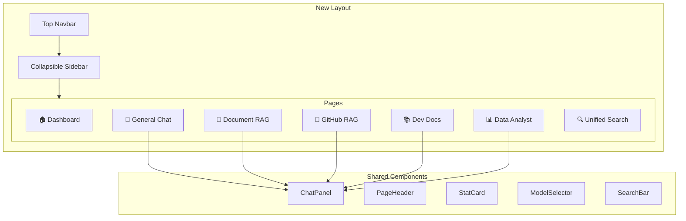

# UI Redesign — Agentic Personal Assistant

إعادة تصميم احترافية كاملة للواجهة مع 7 واجهات رئيسية + تحسين جميع الصفحات المساعدة.

## User Review Required

> [!IMPORTANT]
> **تغيير هيكلي كبير:** سيتم تفكيك ملف `Chat.jsx` (1745 سطر) إلى مكونات مشتركة قابلة لإعادة الاستخدام + صفحات منفصلة. هذا يعني أن **كل الصفحات** ستتغير.

> [!WARNING]
> **لا توجد تغييرات على الـ Backend.** كل التعديلات في الـ Frontend فقط — نفس الـ APIs + نفس الأندبوينتات.

---

## Architecture Overview



---

## Phase 1: Foundation & Design System

### Design System

#### [MODIFY] [index.css](file:///c:/Users/world/Desktop/agentic-personal-assistant/client/src/index.css)

إعادة بناء نظام التصميم بالكامل:

- **CSS Variables جديدة:** ألوان glassmorphism، gradients، shadows، spacing scale
- **Dark theme محسّن:** ألوان أعمق مع gradient accents (indigo → violet → cyan)
- **Light theme محسّن:** ألوان ناعمة مع glassmorphism effects
- **Glassmorphism utilities:** `backdrop-blur`, `bg-opacity`, `border-opacity`
- **Animation keyframes:** fade-in, slide-up, scale-in, shimmer, pulse-glow
- **Scrollbar styling:** مخصص لكل الصفحات
- **Typography:** خط Inter مع أحجام ومسافات محسّنة

---

### Layout System

#### [MODIFY] [AppLayout.jsx](file:///c:/Users/world/Desktop/agentic-personal-assistant/client/src/layouts/AppLayout.jsx)

تحويل من Sidebar-only إلى **Top Navbar + Collapsible Sidebar**:

```
┌─────────────────────────────────────────────┐
│              🔝 Top Navbar                   │
│  [Logo] [Dashboard|Chat|Docs|...] [User|🌙] │
├──────────┬──────────────────────────────────┤
│          │                                   │
│ Sidebar  │         Main Content              │
│ (toggle) │         (Outlet)                  │
│          │                                   │
│ Context- │                                   │
│ specific │                                   │
│ nav      │                                   │
│          │                                   │
└──────────┴──────────────────────────────────┘
```

- **Top Navbar:** شريط علوي ثابت فيه Logo + Navigation tabs + User avatar + Theme toggle
- **Sidebar:** قابل للإخفاء (`←/→` toggle)، يعرض محتوى حسب الصفحة:
  - في Chat: قائمة المحادثات
  - في Document RAG: قائمة المستندات
  - في GitHub RAG: قائمة الريبوات
  - في Dev Docs: قائمة الـ Frameworks
  - في Data Analyst: قائمة الـ Datasets/Sessions

#### [NEW] [TopNavbar.jsx](file:///c:/Users/world/Desktop/agentic-personal-assistant/client/src/components/TopNavbar.jsx)

مكون الشريط العلوي الجديد:
- Logo + اسم التطبيق (مع gradient text)
- Navigation tabs مع أيقونات وAnimations
- Active page indicator (gradient underline)
- User avatar dropdown (Profile, Settings, Logout)
- Theme toggle (مع micro-animation)
- Responsive: hamburger menu على الشاشات الصغيرة

#### [MODIFY] [Sidebar.jsx](file:///c:/Users/world/Desktop/agentic-personal-assistant/client/src/components/Sidebar.jsx)

تحويل من sidebar ثابت إلى sidebar ديناميكي:
- قابل للإخفاء عبر toggle button
- يتغير محتواه حسب الصفحة المفتوحة (via Context)
- مع glassmorphism background
- Smooth slide animation عند الفتح/الإغلاق
- حذف عناصر Navigation (انتقلت للـ TopNavbar)

---

### Shared Components — استخراج من Chat.jsx

#### [NEW] [ChatPanel.jsx](file:///c:/Users/world/Desktop/agentic-personal-assistant/client/src/components/ChatPanel.jsx)

**المكون الأهم:** مكون شات قابل لإعادة الاستخدام يُستخدم في 5 واجهات مختلفة:

```jsx
<ChatPanel
  mode="general" | "document-rag" | "github-rag" | "dev-docs" | "data-analyst"
  sidebarContent={<ConversationsList />}  // محتوى sidebar خاص
  toolbarExtras={<WebSearchToggle />}     // أزرار إضافية
  onSend={handleSend}                     // callback مخصص
  showDataMode={false}                    // إخفاء/إظهار Data Mode
  showMediaUpload={true}                  // إخفاء/إظهار رفع وسائط
/>
```

يتضمن:
- منطقة الرسائل (messages area) مع كل أنواع الرسائل (user, AI, error, system, data-result)
- Composer (شريط الكتابة) مع Model Selector + أزرار الأدوات
- Markdown rendering (ReactMarkdown + KaTeX + Code highlighting)
- Media preview + recording
- Prompt Picker (اختيار الشخصية)
- Auto-scroll + "رسائل جديدة" button
- Copy + Reaction buttons
- Streaming support (SSE)

#### [NEW] [ChatMessage.jsx](file:///c:/Users/world/Desktop/agentic-personal-assistant/client/src/components/ChatMessage.jsx)

استخراج `AiMessageCard` + User message + Error bubble + System message من Chat.jsx.

#### [NEW] [ChatComposer.jsx](file:///c:/Users/world/Desktop/agentic-personal-assistant/client/src/components/ChatComposer.jsx)

استخراج الـ Composer (textarea + toolbar + buttons) من Chat.jsx.

#### [NEW] [ConversationsList.jsx](file:///c:/Users/world/Desktop/agentic-personal-assistant/client/src/components/ConversationsList.jsx)

استخراج `ConversationsPanel` من Chat.jsx ليصبح مكون مستقل.

#### [NEW] [PageHeader.jsx](file:///c:/Users/world/Desktop/agentic-personal-assistant/client/src/components/PageHeader.jsx)

مكون header موحد لكل صفحة:
- عنوان الصفحة مع أيقونة
- وصف مختصر
- Stats bar (أرقام سريعة)
- Action buttons
- Glassmorphism background مع gradient border

#### [NEW] [GlassCard.jsx](file:///c:/Users/world/Desktop/agentic-personal-assistant/client/src/components/GlassCard.jsx)

بطاقة glassmorphism قابلة لإعادة الاستخدام مع hover effects.

---

### New Context

#### [NEW] [SidebarContext.jsx](file:///c:/Users/world/Desktop/agentic-personal-assistant/client/src/contexts/SidebarContext.jsx)

Context للتحكم في Sidebar:
- `isOpen` / `toggleSidebar()` — فتح/إغلاق
- `sidebarContent` / `setSidebarContent()` — تغيير المحتوى حسب الصفحة
- يحفظ الحالة في `localStorage`

---

## Phase 2: Core Interfaces (7 صفحات)

### 🏠 Dashboard

#### [NEW] [Dashboard.jsx](file:///c:/Users/world/Desktop/agentic-personal-assistant/client/src/pages/Dashboard.jsx)

صفحة رئيسية فيها نظرة عامة على كل الأنظمة:

- **Hero Section:** رسالة ترحيب + Quick Actions (بدء محادثة، رفع ملف، إضافة ريبو)
- **Stats Grid:** بطاقات إحصائيات (محادثات، مستندات، ريبوات، frameworks مثبتة)
- **Recent Activity:** آخر المحادثات + آخر المستندات المرفوعة
- **System Overview Cards:** بطاقة لكل نظام (Chat, Doc RAG, GitHub RAG, DevDocs, Data Analyst) مع status + quick link
- **Glassmorphism cards** مع gradient borders وhover effects

API calls: `/api/analytics` + `/api/conversations?limit=5` + `/api/documents` + `/api/github-repos/repos` + `/api/dev-docs/frameworks`

---

### 💬 General Chat

#### [MODIFY] [Chat.jsx](file:///c:/Users/world/Desktop/agentic-personal-assistant/client/src/pages/Chat.jsx)

**إعادة بناء كاملة** — من 1745 سطر إلى ~200 سطر:

- يستخدم `<ChatPanel mode="general" />` المشترك
- يمرر `<ConversationsList />` كـ sidebar content
- جميع ميزات الشات الحالية تبقى كما هي (streaming, media, personas, optimize, web search, model selector)
- **حذف** Data Mode تماماً (انتقل لصفحة Data Analyst)
- **حذف** DevDocs/GitHub toggles من الشات (كل واحد صار صفحة مستقلة)

---

### 📄 Document RAG

#### [NEW] [DocumentRAG.jsx](file:///c:/Users/world/Desktop/agentic-personal-assistant/client/src/pages/DocumentRAG.jsx)

واجهة مخصصة للبحث في المستندات:

- **Layout:** Split view — Chat panel (70%) + Document sidebar (30%)
- **Sidebar:** قائمة المستندات المرفوعة + زر رفع ملف جديد + فلترة
- **Chat:** يستخدم `<ChatPanel mode="document-rag" />` — يبحث فقط في المستندات
- **Header:** إحصائيات المستندات (عدد، حجم، chunks) + زر رفع
- **Upload Zone:** منطقة رفع مدمجة في الأعلى (drag & drop)
- **Document Preview:** عند اختيار مستند من الـ sidebar، يظهر تفاصيله

يجمع بين وظائف `Upload.jsx` + `Documents.jsx` + Chat في واجهة واحدة.

---

### 🐙 GitHub RAG

#### [NEW] [GitHubRAGPage.jsx](file:///c:/Users/world/Desktop/agentic-personal-assistant/client/src/pages/GitHubRAGPage.jsx)

واجهة مخصصة للبحث في مستودعات GitHub:

- **Layout:** Split view — Chat panel (70%) + Repos sidebar (30%)
- **Sidebar:** قائمة الريبوات + حقل إضافة ريبو جديد + فلترة حسب اللغة
- **Chat:** يستخدم `<ChatPanel mode="github-rag" />` — يبحث فقط في الريبوات المفعّلة
- **Header:** إحصائيات (repos, files, chunks) + status indicators
- **Repo Cards:** بطاقات الريبو مع language color dot + stars + toggle

يجمع بين وظائف `GitHubRepos.jsx` + Chat في واجهة واحدة.

---

### 📚 Dev Docs System

#### [NEW] [DevDocsPage.jsx](file:///c:/Users/world/Desktop/agentic-personal-assistant/client/src/pages/DevDocsPage.jsx)

واجهة مخصصة لتوثيق الـ Frameworks:

- **Layout:** Split view — Chat panel (70%) + Frameworks sidebar (30%)
- **Sidebar:** قائمة الـ Frameworks مع status + toggle + categories
- **Chat:** يستخدم `<ChatPanel mode="dev-docs" />` — يبحث في التوثيق المفعّل
- **Header:** إحصائيات (installed, enabled, chunks) + install button (admin)
- **Framework Cards:** مع أيقونة + version + chunk count + toggle

يجمع بين وظائف `DevDocs.jsx` + Chat في واجهة واحدة.

---

### 📊 Data Analyst

#### [NEW] [DataAnalystPage.jsx](file:///c:/Users/world/Desktop/agentic-personal-assistant/client/src/pages/DataAnalystPage.jsx)

واجهة مخصصة لتحليل البيانات (مستخرجة من Chat.jsx):

- **Layout:** Full-width — Chat panel مع dataset overview panel
- **Dataset Panel:** رفع dataset + ملخص البيانات + insights + clean/delete
- **Chat:** يستخدم `<ChatPanel mode="data-analyst" />` مع أدوات تحليل
- **Results:** `AnalysisResultCard` + `ChartRenderer` + code execution blocks
- **Sidebar:** قائمة sessions سابقة
- **Export:** PDF export button

ينقل كل الـ Data Analyst logic من Chat.jsx لصفحة مستقلة.

---

### 🔍 Unified Search

#### [NEW] [UnifiedSearch.jsx](file:///c:/Users/world/Desktop/agentic-personal-assistant/client/src/pages/UnifiedSearch.jsx)

صفحة بحث موحدة:

- **Search Bar:** حقل بحث كبير مع autofocus وglass background
- **Source Filters:** toggles لاختيار المصادر (Documents ✓ / GitHub ✓ / DevDocs ✓)
- **Results:** مقسمة حسب المصدر مع preview + relevance score
- **Quick Actions:** فتح المستند أو الملف أو بدء محادثة مع السياق

API: استخدام `/api/chat` endpoint مع تفعيل كل الـ RAG sources.

---

## Phase 3: Support Pages

### [MODIFY] [Login.jsx](file:///c:/Users/world/Desktop/agentic-personal-assistant/client/src/pages/Login.jsx)

- Glassmorphism card مع gradient border
- Animated logo (pulse/glow)
- Smooth form transitions
- Background gradient animation (subtle)
- Error shake animation

### [MODIFY] [Register.jsx](file:///c:/Users/world/Desktop/agentic-personal-assistant/client/src/pages/Register.jsx)

- نفس الـ design language كصفحة Login
- Step indicator (إذا أمكن)
- Password strength meter

### [MODIFY] [Admin.jsx](file:///c:/Users/world/Desktop/agentic-personal-assistant/client/src/pages/Admin.jsx)

- Glassmorphism stat cards مع gradient backgrounds
- جدول مستخدمين محسّن مع search + filter
- Charts (user growth, activity heatmap)
- Quick actions مع confirm modals

### [MODIFY] [Analytics.jsx](file:///c:/Users/world/Desktop/agentic-personal-assistant/client/src/pages/Analytics.jsx)

- Glassmorphism cards
- Improved chart styling مع animations
- More chart types (bar chart لأنواع الملفات بدلاً من pie)
- Date range selector

### [MODIFY] [Settings.jsx](file:///c:/Users/world/Desktop/agentic-personal-assistant/client/src/pages/Settings.jsx)

- Section cards محسّنة مع glassmorphism
- Better toggle switches
- Save confirmation animation

---

## Phase 4: Routing Update

### [MODIFY] [App.jsx](file:///c:/Users/world/Desktop/agentic-personal-assistant/client/src/App.jsx)

إضافة Routes جديدة:

```jsx
<Route path="/" element={<Navigate to="/dashboard" />} />
<Route path="/dashboard" element={<Dashboard />} />
<Route path="/chat" element={<Chat />} />
<Route path="/document-rag" element={<DocumentRAG />} />
<Route path="/github-rag" element={<GitHubRAGPage />} />
<Route path="/dev-docs" element={<DevDocsPage />} />
<Route path="/data-analyst" element={<DataAnalystPage />} />
<Route path="/search" element={<UnifiedSearch />} />
<Route path="/analytics" element={<Analytics />} />
<Route path="/settings" element={<Settings />} />
<Route path="/admin" element={<Admin />} />
```

### Files to Remove (merged into new pages)

- ~~`Upload.jsx`~~ → merged into `DocumentRAG.jsx`
- ~~`Documents.jsx`~~ → merged into `DocumentRAG.jsx`
- Old `GitHubRepos.jsx` → replaced by `GitHubRAGPage.jsx`
- Old `DevDocs.jsx` → replaced by `DevDocsPage.jsx`

---

## Design Tokens Summary

| Token | Dark | Light |
|-------|------|-------|
| Background | `#0a0e1a` → `#0f1629` | `#f0f4ff` → `#ffffff` |
| Surface | `rgba(15,22,41,0.6)` glass | `rgba(255,255,255,0.7)` glass |
| Primary | Indigo-Violet gradient (`#6366f1` → `#8b5cf6`) | Same |
| Accent | Cyan-Emerald (`#06b6d4` → `#10b981`) | Same |
| Border | `rgba(99,102,241,0.15)` | `rgba(99,102,241,0.1)` |
| Glow | `0 0 30px rgba(99,102,241,0.15)` | None |

---

## Verification Plan

### Browser Testing (Primary)
- Start dev server: `cd client && npm run dev` (port 5173)
- Start backend: `cd server && node index.js` (port 3001)
- Verify each page visually using the browser tool:
  1. Login/Register pages render correctly with new animations
  2. Dashboard loads with stats cards and quick actions
  3. General Chat works with streaming, personas, model selector
  4. Document RAG shows document list + embedded chat
  5. GitHub RAG shows repos list + embedded chat
  6. Dev Docs shows frameworks + embedded chat
  7. Data Analyst has dataset upload + analysis chat
  8. Unified Search shows search bar + source filters
  9. Sidebar toggles open/close correctly
  10. Top Navbar navigation works between pages
  11. Theme toggle (dark/light) works globally
  12. Responsive layout on different viewport sizes

### Build Verification
- Run `cd client && npm run build` to ensure no compilation errors
- Run `cd client && npm run lint` to check for code quality issues

### Manual Verification (User)
- User should test login → navigate all pages → try chat → toggle theme → toggle sidebar
